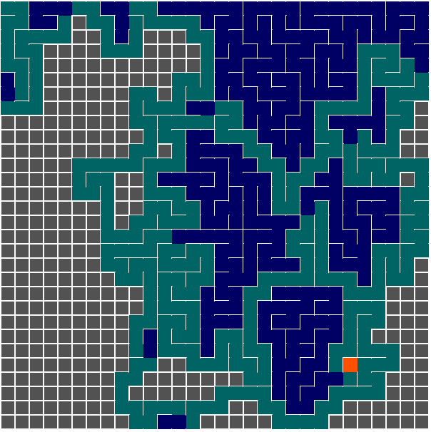
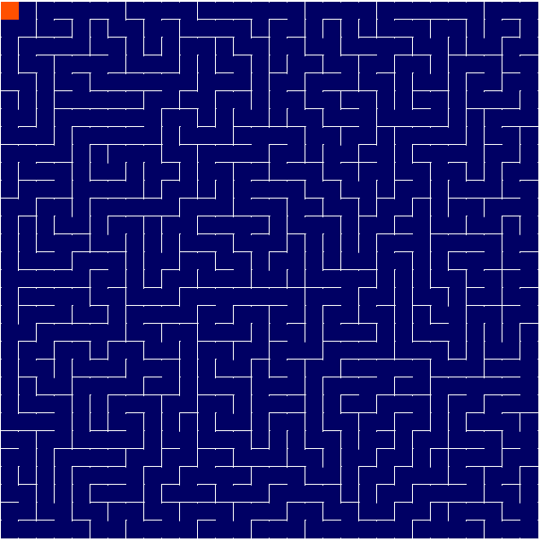

# Maze generator

**Número da Lista**: 1 
**Conteúdo da Disciplina**: Grafos 1 

## Alunos
|Matrícula | Aluno |
| -- | -- |
| 16/0007739  |  Guilherme Marques Rosa |
| xx/xxxxxx  |  xxxx xxxx xxxxx |

## Sobre 
Animação procedural mostrando uma aplicação do algoritmo de travesia DFS para a geração de labirintos de forma automática.

## Screenshots

## Instalação 
**Linguagem**: Javascript 
**Framework**: P5js 

Basta utilizar docker compose para subir a aplicação:
- `docker-compose build`
- `docker-compose up`

Ou utilizar algum server http para servir o diretório, por exemplo o http-serve

- `http-serve -p 3000 .`

## Uso 
Basta acessar http://localhost:3000 que o projeto automaticamente começa a rodar

